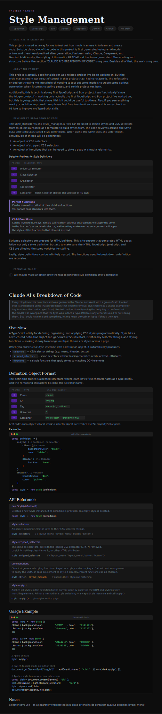

# STYLE MANAGEMENT

## Originality Statement

This project is used as a way for me to test out how much I can use AI to learn and create code. So to be clear, a lot of the code in this project is first generated using an AI model or two, and then heavily edited after generation; I've been using Claude, Deepseek, and Gemini. Besides that, the work is my own.

Additionally, the styling of this entire README.md has been generated.  The wording and structure before the section "CLAUDE AI'S BREAKDOWN OF CODE" is my own.

## About the Project

This project is actually a tool for a bigger web related project I've been working on, but the style management got so out of control in that project that I had to refactor it. The refactoring ended up throwing me into a hole of wanting to test out some models to create some serious automation when it comes to styling pages, and so this project was born.

Additionally, this is technically my first TypeScript and Bun project. I say "technically" since the bigger project I'm working on is actually the first TypeScript and Bun project I've worked on, but this is going public first since I think it could be useful to others. Also, if you see anything wonky or could be improved then please feel free to submit an issue and I can resolve it — I'd love to improve my TypeScript skills.

## Tools Used

`TypeScript` `JavaScript` `Bun` `Claude` `Deepseek` `Gemini` `GitHub` `My Brain`

## Developers's Breakdown of Code

The `style_manager.ts` and `style_manager.js` files can be used to create styles and CSS selectors from an object that is purposed as a template to build styles from. The code revolves around the **Style** class and templates I call **Style Definitions** (they're just objects that can hold other objects in them). When using the Style class and a definition to create a variable a multitude of things will be generated. This includes:

- An object of CSS selectors.
- An object of stripped CSS selectors.
- An object of functions that can be used to style a page or singular elements.

All selector forms are supported by the Style type through the use of single-letter prefixes that can be used on nested objects within whatever style definition you create. These prefixes include:

| Prefix | Selector Type |
|--------|--------------|
| `u` | Universal Selector |
| `c` | Class Selector |
| `i` | ID Selector |
| `t` | Tag Selector |
| `o` | Object that holds selector objects (container for organization) |

Generated functions have two types, parents and children:

> **Parent functions** can be invoked to call all of their children functions. You can not pass elements into them.

> **Child functions** can be invoked in 2 ways — simply calling them without an argument will apply the style to the function's associated selector, and inserting an element as an argument will apply the styles of the function to the element instead.

Stripped selectors are present for HTML builders. This is to ensure that generated HTML pages follow not only a style definition but also to make sure the HTML, TypeScript, JavaScript, and CSS are all using the same variables for styling.

Lastly, style definitions can be infinitely nested. The functions used to break down a definition are recursive.

## Potential To-Do?

- Will maybe make an option down the road to generate style definitions off of a template?
- Make it so that function calls aren't string key lookups and just make them flat calls?

---

# CLAUDE AI'S BREAKDOWN OF CODE

_Everything from this point forward was generated by Claude, so take it with a grain of salt.  I looked over it and noticed some inaccurate notes that I had to remove, plus there was a usage example for tag
functions that had a typo I fixed; I tested the functionality using the body tag to confirm that the model was wrong and that the typo was in fact a typo.  If there's any other issues, I'm not seeing them.  But I could have missed something, let me know through an issue if that's the case._

A TypeScript utility for defining, organizing, and applying CSS styles programmatically. `Style` takes a structured definition object and generates CSS selectors, DOM-ready selector strings, and styling functions — making it easy to manage multiple themes or styles across a page.

## Overview

When you construct a `Style` instance with a definition object, it automatically produces:

- **`selectors`** — CSS selector strings (e.g. `.menu`, `#header`, `button`)
- **`stripped_selectors`** — the same selectors without their leading character (e.g. `menu`, `header`), ready for use in HTML attributes
- **`functions`** — callable functions that apply styles to matching DOM elements

## Definition Object Format

The definition object is a nested structure where each key's **first character acts as a type prefix**, and the **remaining characters become the selector name**.

| Prefix | Type | CSS Equivalent |
|--------|------|----------------|
| `c` | Class | `.name` |
| `i` | ID | `#name` |
| `t` | Tag | `name` (e.g. `button`) |
| `u` | Universal | `*` |
| `o` | Container | *(no selector — grouping only)* |

Leaf nodes (non-object values) inside a selector object are treated as CSS property/value pairs.

### Example

```typescript
const definition = {
    oLayout: {                          // container (no selector)
        cMenu: {                        // → .menu
            backgroundColor: "black",
            color: "white",
        },
        iHeader: {                      // → #header
            fontSize: "2rem",
        },
    },
    tButton: {                          // → button
        borderRadius: "4px",
        cursor: "pointer",
    },
};

const style = new Style(definition);
```

## API

### `new Style(definition?)`

Creates a new `Style` instance. If no definition is provided, an empty style is created.

```typescript
const style = new Style(definition);
```

### `style.selectors`

An object mapping selector keys to their CSS selector strings.

```typescript
style.selectors;
// {
//     layout_menu:   ".layout_menu",
//     layout_header: "#layout_header",
//     button:        "button",
// }
```

### `style.stripped_selectors`

The same as `selectors`, but with the leading CSS character (`.`, `#`, `*`) removed. Useful for setting `className`, `id`, or other HTML attributes.

```typescript
style.stripped_selectors;
// {
//     layout_menu:   "layout_menu",
//     layout_header: "layout_header",
//     button:        "button",
// }
```

### `style.functions`

An object of generated styling functions, keyed as `style_<selector_key>`.

Each function can be called in two ways:

**Without an argument** — queries the DOM and styles all matching elements:
```typescript
style.functions["style_layout_menu"]();
```

**With an element** — applies the style directly to a provided element, bypassing the DOM query:
```typescript
style.functions["style_button"](someElement);
```

**Parent functions** — selectors that contain nested selectors generate a parent function that calls all of their children:
```typescript
style.functions["style_layout"](); // applies layout_menu and layout_header
```

### `style.apply()`

Applies all styles in the definition to the current page by querying the DOM and styling every matching element.

```typescript
style.apply();
```

This is the primary method for style switching — swap out a `Style` instance and call `apply()` to restyle the entire page.

## Usage Example

```typescript
const light = new Style({
    cCard: {
        backgroundColor: "#ffffff",
        color: "#111111",
    },
    tButton: {
        backgroundColor: "#eeeeee",
        color: "#111111",
    },
});

const dark = new Style({
    cCard: {
        backgroundColor: "#1a1a1a",
        color: "#f0f0f0",
    },
    tButton: {
        backgroundColor: "#333333",
        color: "#f0f0f0",
    },
});

// Apply on load
light.apply();

// Switch to dark mode
document.getElementById("toggle")?.addEventListener("click", () => {
    dark.apply();
});

// Apply a style to a newly created element
const card = document.createElement("div");
card.className = light.stripped_selectors["card"];
light.functions["style_card"](card);
document.body.appendChild(card);
```

## Notes

- Selector keys use `_` as a separator when nested (e.g. a class `cMenu` inside a container `oLayout` becomes `layout_menu`).

## Claude Generated Image for README.md

